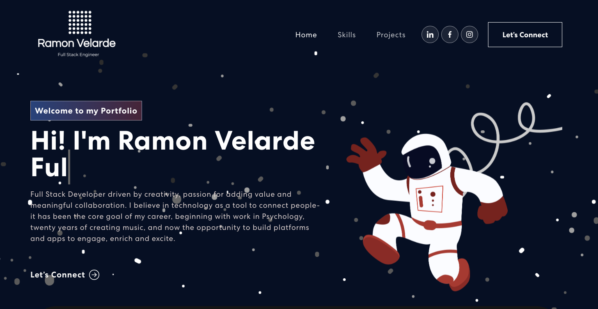
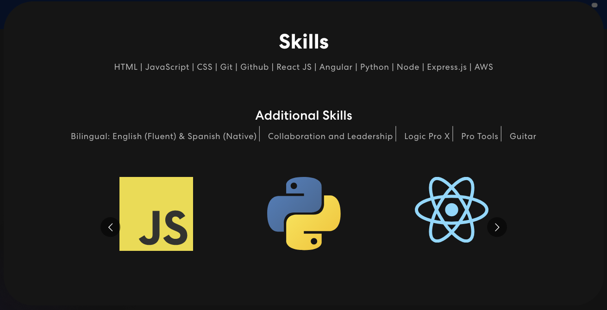
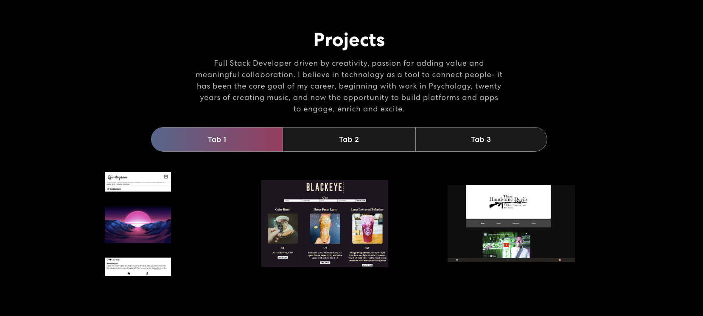
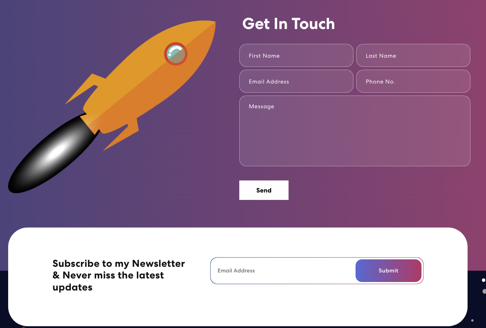

# Portfolio for RV

This site features the work and contact information of Ramon Velarde. It's a React frontend website that generates Mailchimp subscriptions to Newsletters and has a buil in Contact form, besides animations and styling features.

## Technologies

- JavaScript, React, Animate Css,  Css, Bootstrap, Express, etc.

# Link

https://delicate-marshmallow-eff5bd.netlify.app

# Images of the Site

